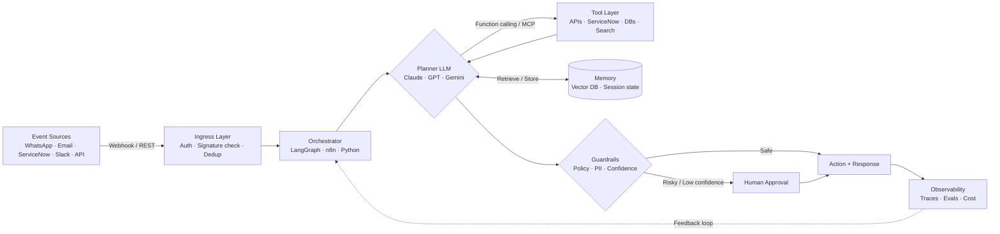

# Daisy Grace Thomas

### Agentic AI Lead Consultant · AI Mentor · Founder, DaisyWithAI

[](https://linkedin.com/in/daisywithai)

**Your team doesn't need another chatbot. It needs AI agents that plan, call tools, and finish the job.** I design them, ship them, and train your people to run them.

[](mailto:daisywithai@gmail.com) [](https://linkedin.com/in/daisywithai) [](mailto:daisywithai@gmail.com?subject=AI%20Mentorship)

---

## ⚡ Why companies call me

> 80% of enterprise AI pilots never make it past the demo stage. The model is rarely the problem. Integration, control and trust are.

That gap is where I work. 10+ years turning business problems into production systems across **Healthcare, Aerospace, EdTech and IT**. Engineering roots at **Rolls Royce** and **Boeing**. Now I build agentic AI that survives audits, edge cases and real users.

| Business pain | What I deliver |
| --- | --- |
| "We have AI pilots, nothing in production" | Production-grade agent architecture with guardrails and rollout plan |
| "Our teams drown in tickets and manual requests" | Agents that triage, route and fulfil inside ServiceNow and your stack |
| "We're regulated. We can't risk a rogue AI" | Human-in-the-loop controls, audit trails, GAMP5-aware validation |
| "Our people don't know how to use AI" | Hands-on AI enablement programs that turn non-coders into builders |

---

## 🏗 Agent architecture I build



---

## 🧰 Agentic AI tech stack

| Layer | Tools & techniques |
| --- | --- |
| **Foundation Models** | Claude, GPT, Gemini, Llama, Mistral, open models via Hugging Face |
| **Agent Frameworks** | LangChain, LangGraph, CrewAI, AutoGen, OpenAI Agents SDK, Claude Agent SDK |
| **Agent Protocols** | MCP (Model Context Protocol), A2A, function calling, JSON Schema tools, structured outputs |
| **Workflow Automation** | n8n, Make, Zapier, Power Automate, ServiceNow Flow Designer & IntegrationHub |
| **Triggers & Integration** | Webhooks, signature verification, REST APIs, OAuth 2.0, Meta WhatsApp Cloud API, Gmail & Google Workspace APIs |
| **Memory & RAG** | Embeddings, chunking strategies, LlamaIndex, Pinecone, ChromaDB, pgvector, hybrid search |
| **Reasoning Patterns** | ReAct, planner/executor, reflection, multi-agent handoffs, tool routing |
| **Safety & Governance** | Guardrails, PII masking, prompt injection defence, HITL approvals, audit logging, GAMP5 validation |
| **Evals & Observability** | LangSmith, Langfuse, Promptfoo, Ragas, golden datasets, regression evals, tool-call accuracy |
| **Deploy & Ops** | Python, FastAPI, Docker, GitHub Actions, Cloudflare, self-hosted n8n, secrets management |
| **AI Dev Tools** | Claude Code, Cursor, GitHub Copilot, ChatGPT, Gemini, Perplexity, NotebookLM |

                 

---

## 🚀 Featured builds

| Project | What it does | Under the hood |
| --- | --- | --- |
| **CareerAgent** | Agentic AI that analyses profiles, matches roles and drafts outreach for job seekers | Python, LLM tool calling, RAG, structured outputs |
| **Daisy AI Agent** | WhatsApp agent that handles conversations end to end, 24/7 | Meta webhook ingress, n8n orchestration, Gemini, session memory, Cloudflare Tunnel |
| **ServiceNow Agentic Workflows** | AI-driven triage, routing and fulfilment for enterprise ITSM | ServiceNow Flow Designer, Scripted REST, LLM classification |
| **Agent Testing Framework** | Validates agent decisions, tool calls and failure handling before go-live | Python, eval datasets, adversarial test suites |

---

## 🔁 The DaisyWithAI delivery method

```
01 DISCOVER  →  Business outcome, risk, ROI. Which jobs should an agent own?
02 DESIGN    →  Tools, schemas, auth, memory, guardrails. Architecture on paper first.
03 BUILD     →  Orchestration, tool calling, integrations, webhooks.
04 CONTROL   →  Confidence gates, human approvals, audit trails.
05 PROVE     →  Evals, edge cases, adversarial tests, API failure drills.
06 SCALE     →  Observability, cost tuning, team enablement, handover.
```

---

## 💼 Work with me

| 🧭 AI Strategy Sprint   For leaders who need clarity.   Identify your top agent use cases, ROI and risk. Leave with a roadmap and architecture you can fund. | 🏗 Agent Build & Advisory   For teams ready to ship.   I lead design and delivery of production agents integrated with your systems. Guardrails and evals included. | 🎓 AI Mentorship & Training   For people and teams leveling up.   1:1 mentoring and corporate workshops on AI automation and agentic AI. Built for non-coders and career pivoters. |
| --- | --- | --- |

---

## 🎓 Credentials

**MSc Data Science**, Deakin University **Generative AI**, IIT Patna **10+ years** across ServiceNow, enterprise integration and data Aeronautical engineering foundation · Rolls Royce · Boeing

---

## 📬 Let's build your first production agent

**Have an AI idea stuck in pilot? A process your team hates? A team that needs to get AI-ready?** Send me one line about it. I reply within 24 hours.

[](mailto:daisywithai@gmail.com?subject=Agentic%20AI%20Consulting%20Enquiry) [](https://linkedin.com/in/daisywithai)

\


 

*Agents that don't just answer. Agents that deliver.*

📍 Chennai, India · Working with clients globally
